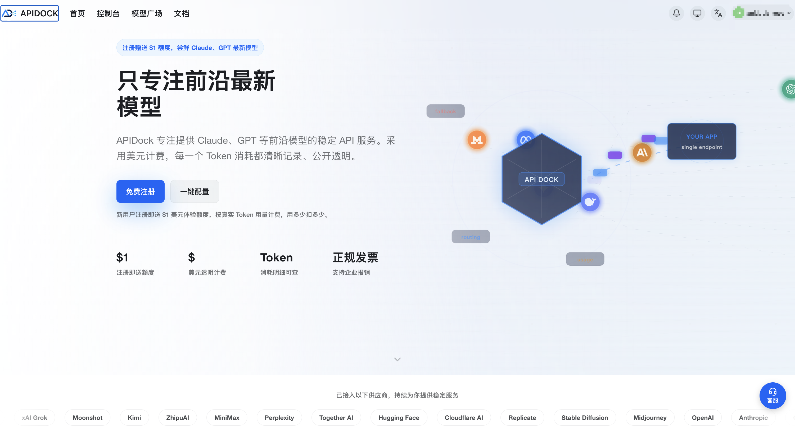
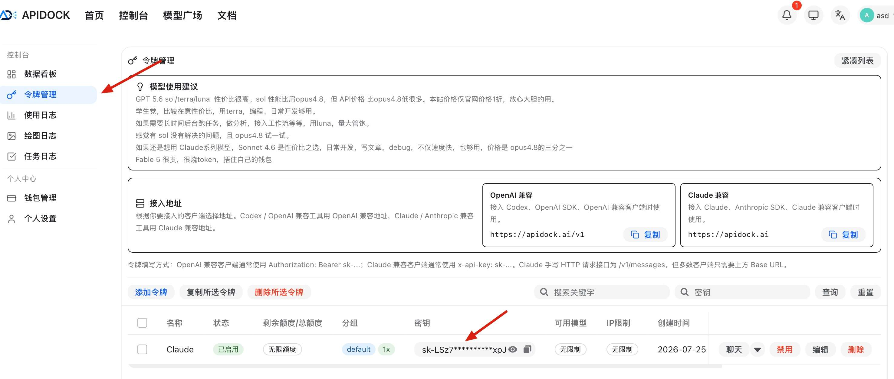

# GPT API、Claude API 国内接入教程：GPT-6 Astra、GPT-5.6、Opus 5、Fable 5.1 与中转站

想在国内调用 GPT API 或 Claude API？本文以 GPT-6 Astra、GPT-5.6、Claude Opus 5 和 Fable 5.1 为例，介绍模型 ID、官方接口与中转站的区别，并给出可直接运行的 `curl` 和 Python 接入示例。

> 非官方声明： 本项目为独立的第三方教程整理项目，与 OpenAI、Anthropic、GitHub 等公司不存在官方合作、授权或隶属关系。ChatGPT、OpenAI、Claude、Anthropic 等商标归各自权利人所有。

> 更新于 2026-09-19。如果你对有帮助的话，希望给一个小⭐️⭐️支持一下，本教程持续更新。

## 先选接入方式

| 方式 | 需要准备 | 适用情况 |
| --- | --- | --- |
| 官方 API | 对应厂商的开发者账号、API Key、受支持的地区与付款方式 | 希望直接使用官方接口与完整功能 |
| 兼容中转服务 | 服务商签发的 Token、Base URL、可用模型名 | 官方账号、付款或网络接入不方便时，先小额验证 |

国内直接接入 GPT API、Claude API 需要中转，否则无法直接接入。 

需要中转服务的话，可以参考这家的[中转服务](https://apidock.ai/)。

它提供独立 Token 和接入说明；**先确认所需模型是否开放、支持哪种接口协议，再用小额请求测试**。中转服务会处理请求内容，敏感数据应先评估隐私条款。

ChatGPT Plus、Claude 订阅与 API 用量分别计费；网页会员资格不能直接当作 API Key 使用。中转 Token 也不能登录官方产品。

## 这几个模型怎么选

| 模型 | API 模型 ID | 适合的起点 |
| --- | --- | --- |
| GPT-5.6 Luna | `gpt-5.6-luna` | 摘要、分类等高频轻任务 |
| GPT-5.6 Terra | `gpt-5.6-terra` | 日常编程、内容生成，兼顾效果与成本 |
| GPT-5.6 Sol | `gpt-5.6-sol` | 更复杂的代码与专业任务 |
| GPT-6 Astra | `gpt-6-astra` | 高难度推理、长流程和工具协作 |
| Claude Opus 5 | `claude-opus-5` | 复杂编程与日常 Agent 工作流 |
| Claude Fable 5.1 | `claude-fable-5-1` | 更难的长流程推理、研究与 Agent 任务 |

这只是选型起点，生产环境最好用自己的任务比较效果、延迟和每次完成任务的成本。[OpenAI 模型说明](https://developers.openai.com/api/docs/models)与[Claude 选型指南](https://platform.claude.com/docs/en/about-claude/models/choosing-a-model)提供最新定位。

## 使用中转接入Claude Code、GPT API

流程不复杂：

1. 打开 [APIDock](https://apidock.ai/) 注册账号。
2. 在后台创建自己的 API Key，不要把 Key 发给别人。
3. 先到 [模型与价格页](https://apidock.ai/pricing) 确认 Fable 5.1 已对当前账户开放，并核对实时单价。
4. 按 [APIDock一键安装文档](https://apidock.ai/docs/apidock-easy-install) 配置 Claude Code。
5. 安装完成后，用专属命令 `claude-apidock` 启动。
6. 选择模型 `claude-opus-5`，先发一个小任务验证。

APIDock 的一键工具使用独立配置，不会覆盖原来的 `claude` 命令。以后需要换 Key，可以按文档运行 `apidock reset claude-code`。

## 接入前后检查什么

1. 在平台模型列表核对**实际模型 ID**、接口类型、价格和限额；同名展示不保证接口能力相同。
2. 用无敏感内容的小请求确认响应与用量账单，再测试流式输出、工具调用等所需功能。
3. `401` 检查 Key；`404` 检查 Base URL、路径和模型名；`429` 检查额度与速率限制。
4. Token 放在环境变量或密钥管理服务中；泄露后立即撤销并重建，不向他人提供密码、验证码或 Cookie。

更多背景见 [GPT API 国内接入教程](docs/gpt-api-china.md)、[GPT-5.6 选型说明](docs/gpt-5-6-api.md)和[中转服务检查清单](docs/api-proxy-guide.md)。
